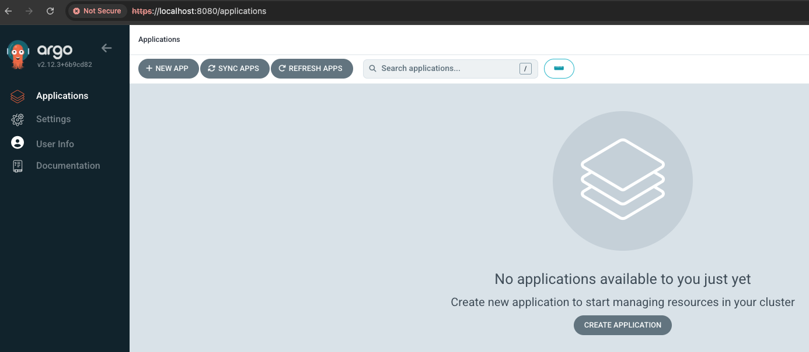
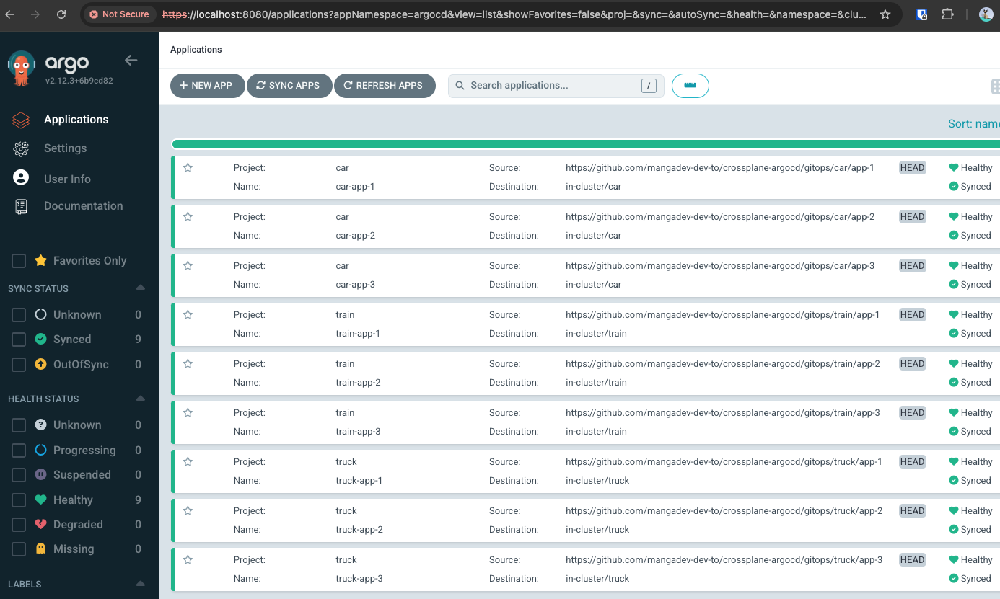
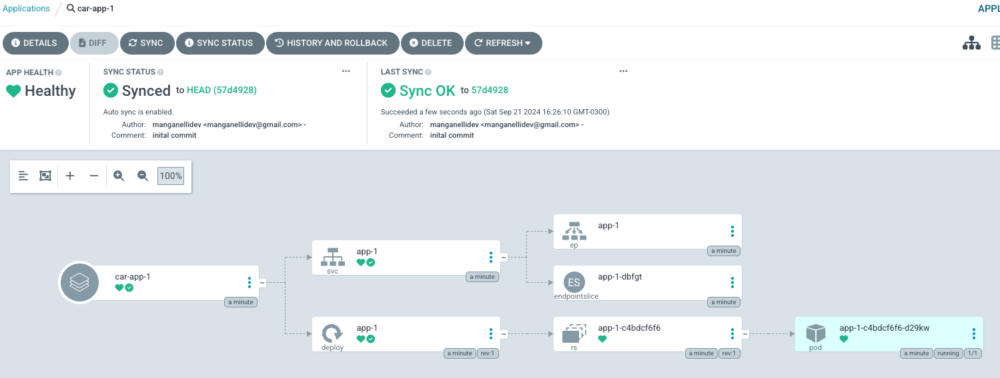
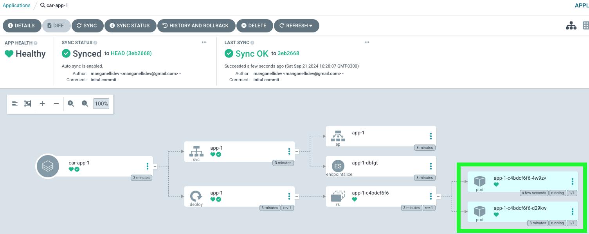

# GitOps + ArgoCD: A Perfect Match for Kubernetes Continuous Delivery

https://dev.to/mangadev/gitops-argocd-a-perfect-match-for-kubernetes-continuous-delivery-5d97

## Introduction

Deploying and managing Kubernetes applications can be complex, but GitOps simplifies it by treating your Git repository as the single source of truth for deployments. ArgoCD streamlines this process further by automatically syncing your Kubernetes clusters with your Git repository.

In this guide, we’ll walk you through setting up GitOps with ArgoCD, making your Kubernetes deployments fast, consistent, and automated. If you're aiming to simplify your workflow, stay tuned—this tutorial will get you up and running in no time.

To dive deeper into GitOps, check out this detailed blog post by @sujal_dua:
[GitOps Adoption: A Simple Guide to Modern Cloud Management](https://dev.to/sujal_dua/gitops-adoption-a-simple-guide-to-modern-cloud-management-nai).

## Hands-on 🚀

### Prerequisites
- [Docker Desktop](https://www.docker.com/products/docker-desktop/)
- [kubectl](https://kubernetes.io/docs/tasks/tools/)
- [Helm](https://helm.sh/docs/intro/install/)
- [Kind](https://kind.sigs.k8s.io/docs/user/quick-start)
- [VS Code](https://code.visualstudio.com/download) (or any code editor)

### **Clone the Hands-on GitHub Repository**
```bash
git clone git@github.com:mangadev-dev-to/gitops-argocd.git
```

### **Folder Structure**
```bash
├── argocd
├── gitops
├── kind
└── rendered-resources
```
- **gitops**: The source of truth for all application manifests (typically stored in a separate repository).
- **kind**: Contains local cluster configuration.
- **argocd**: Contains ArgoCD configuration, from installation to resources.
- **rendered-resources**: Contains the rendered ArgoCD manifests.

### **Create a Kind Cluster**
```bash
kind create cluster --config=kind/kind.yaml --name=gitops-argocd
```

### **Install ArgoCD**: Install ArgoCD on your Kind cluster
```bash
# Ensure you're in the Kind cluster. This command should return 'kind-gitops-argocd' context.
kubectl config current-context

# Add the ArgoCD Helm repository
helm repo add argo https://argoproj.github.io/argo-helm

# Update the local Helm chart cache
helm repo update

# Install the ArgoCD Helm chart
helm install argocd --namespace argocd --create-namespace argo/argo-cd

# Create context for the ArgoCD namespace
kubectl config set-context kind-ns-argocd --namespace argocd --cluster kind-gitops-argocd --user kind-gitops-argocd

# Set the current context for the argocd namespace
kubectl config use-context kind-ns-argocd

# Grant cluster-admin role to the ArgoCD service account (use with caution in production)
kubectl apply -f argocd/rbac/argocd-svc-account-clusterrole-admin-binding.yaml

# Get the admin password via kubectl
kubectl get secret argocd-initial-admin-secret -o jsonpath="{.data.password}" | base64 -d

# Access the ArgoCD UI (http://localhost:8080) using 'admin' as the username and the copied password
kubectl port-forward service/argocd-server 8080:443
```


### **Prepare ArgoCD Resources**: Set up ArgoCD Projects and Applications
```bash
# Render Helm Charts
./resource-helm-template-generator.sh car
./resource-helm-template-generator.sh truck
./resource-helm-template-generator.sh train

# Validate if the rendered Helm Charts are present in the 'rendered-resources' folder
```

### **Create ArgoCD Resources**: Apply the rendered resources
```bash
# Create the rendered Helm Charts
kubectl apply -f rendered-resources/

# Validate in the ArgoCD UI (http://localhost:8080) that the applications are up and running
```


### **Update Application**: Make changes to the application and let ArgoCD handle reconciliation
1. Open the manifest `gitops/car/app-1/deployment.yaml` and change the replicas value to 2 on line 38.
2. Save and push the changes to GitHub repository.
3. Wait 3 minutes or manually sync the `car-app-1` in ArgoCD.
4. Verify that the `car` application now has two pods running.

**Before Changes:**



**After Changes:**



## **Final Thoughts**

- For simplicity, we kept the GitOps application manifests in the same repository and made changes manually, without using automation tools like GitHub Actions, Azure DevOps, or Jenkins.
- ArgoCD offers an intuitive UI, enabling development teams to manage their applications effortlessly.
- With just a few steps, you've enhanced application management, improving robustness, observability, and maintainability using a declarative approach.

That's it! Happy coding! 🎉🎉🎉
